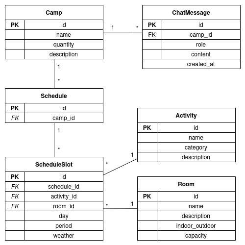

# cf_ai_camp_scheduler

An AI-powered summer camp schedule builder running on the Cloudflare Developer Platform.

Chat with an AI assistant (Llama 3.3 70B via Workers AI) over WebSocket to create and manage camp schedules. The AI understands natural language and uses tools to persist data in a D1 database through a Durable Object session.

---

## Architecture

| Component | Technology |
|-----------|------------|
| Backend Worker | Cloudflare Workers + Hono |
| Real-time session | Durable Objects (WebSocket) |
| AI model | `@cf/meta/llama-3.3-70b-instruct-fp8-fast` via Workers AI |
| Database | Cloudflare D1 (SQLite) |
| Frontend | React + Vite deployed as a Cloudflare Worker |

### Data Model



The schema consists of six tables:

- **Camp** — a summer camp with dates and capacity
- **Activity** — a schedulable activity (sport / cultural / slow, indoor or outdoor)
- **Room** — a physical space with capacity and indoor/outdoor flag
- **Schedule** — links a set of slots to a camp
- **ScheduleSlot** — assigns an activity + room to a specific day (1–7) and period (morning / afternoon)
- **ChatMessage** — persists conversation history per camp for multi-turn AI context

---

## Running Locally

### Prerequisites

- Node.js >= 18
- A Cloudflare account with Workers and D1 access
- `wrangler` CLI authenticated (`npx wrangler login`)

---

### Backend

```bash
cd backend
npm install
```

Create a `.dev.vars` file for local environment variables:

```bash
echo "ALLOWED_ORIGIN=http://localhost:5173" > .dev.vars
```

Apply the D1 migration locally:

```bash
npx wrangler d1 execute camps_database --local --file=migrations/0001_init.sql
```

Start the dev server:

```bash
npx wrangler dev
```

The backend will be available at `http://localhost:8787`.

#### Connect via WebSocket

```bash
npx wscat -c "ws://localhost:8787/ws?camp-id=1"
```

Replace `camp-id` with the ID of an existing camp. If not the AI will create one for you. 
You can then chat with the AI directly from the terminal:

```
> Create a camp called "Summer 2025" starting 2025-07-01 and ending 2025-07-14 for 30 kids
< [Tool Used: Create Camp] Camp created with id 1
< I've created the camp "Summer 2025" running from July 1st to 14th for 30 campers.

> Add a football activity, outdoor sport
< [Tool Used: Create Activity] Activity created with id 1
< Football has been added as an outdoor sport activity.

> Create a schedule for camp 1
< [Tool Used: Create Schedule] Schedule created with id 1

> Assign football on day 1 morning in the main field
< [Tool Used: Assign Slot] Slot assigned with id 1
< Football is now scheduled for Monday morning on the main field.
```

---

### Frontend

```bash
cd frontend
npm install
npm run dev
```

The frontend dev server will be available at `http://localhost:5173`.

> Make sure the backend is running on port 8787 so the frontend can connect to the WebSocket.

---

## Potential Improvements

- **WebSocket reconnection** — automatically reconnect with backoff if the connection drops, and surface the status to the user
- **Streaming AI responses** — stream tokens as they arrive instead of waiting for the full reply, using Workers AI's streaming support
- **Schedule conflict detection** — reject `assign_slot` calls that double-book a room for the same day and period
- **Weather-aware scheduling** — integrate a weather API to prefer indoor activities on rainy days when building a schedule
- **Schedule comparison** — side-by-side diff view when a camp has multiple schedules
- **Delete / update tools** — give the AI the ability to remove or modify existing slots, activities, and rooms
- **Authentication** — gate the app behind Cloudflare Access or a simple auth layer so only authorized users can manage camps
- **Export** — download a schedule as CSV or PDF directly from the UI

---

## AI Tools

The AI assistant has access to the following tools:

| Tool | Description |
|------|-------------|
| `create_camp` | Creates a new summer camp |
| `create_activity` | Adds an activity (sport / cultural / slow) |
| `create_room` | Adds a room or outdoor space |
| `create_schedule` | Creates an empty schedule for a camp |
| `assign_slot` | Assigns an activity + room to a day and period |
| `get_activities` | Lists all available activities |
| `get_rooms` | Lists all available rooms |
| `get_schedule` | Retrieves the full schedule for a given schedule ID |

The AI automatically decides whether to call tools based on message intent — action phrases like "create", "add", "assign" trigger tool use, while questions get direct answers.
